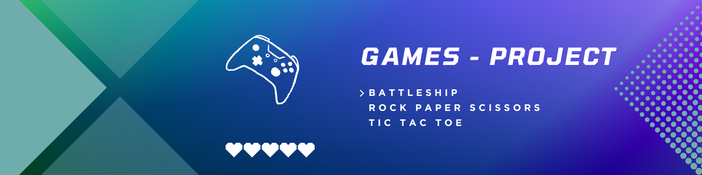

# 🎮 Games Project 🎮




## 🎯 Project Overview

This project is a modern implementation of classic games using Streamlit, providing an interactive and user-friendly web interface. The games are designed to be both entertaining and challenging, with a focus on clean code, testing, and continuous integration.

## 🎲 Included Games

1. **Tic Tac Toe** ❌⭕
   - A classic strategy game for two players
   - Features both easy and hard AI difficulty levels
   - Clean, responsive interface with visual feedback
   - Real-time game state updates

2. **Battleship** 🚢💥
   - Strategic naval warfare game
   - 5x5 grid gameplay
   - Three ships per player
   - Visual feedback for hits and misses
   - AI opponent with random ship placement

3. **Rock, Paper, Scissors, Lizard, Spock** ✊📄✂️🦎🖖
   - Extended version of the classic game
   - Five possible choices
   - First to three wins
   - Animated results display
   - Score tracking

## 🚀 Getting Started

### Prerequisites
- Python 3.9 or higher
- pip (Python package manager)
- Docker (optional, for containerized deployment)

### Local Installation

1. Clone the repository:
```bash
git clone https://github.com/Jotis86/Games-Project.git
cd Games-Project
```

2. Install dependencies:
```bash
pip install -r requirements.txt
```

3. Run the application:
```bash
streamlit run streamlit_app/app.py
```

### Docker Deployment

1. Build the Docker image:
```bash
docker build -t arcade-games-hub .
```

2. Run the container:
```bash
docker run -p 8501:8501 arcade-games-hub
```

The application will be available at `http://localhost:8501`

#### Useful Docker Commands
- Run in background:
```bash
docker run -d -p 8501:8501 arcade-games-hub
```

- View running containers:
```bash
docker ps
```

- Stop a container:
```bash
docker stop <container_id>
```

## 🧪 Testing

### Running Tests Locally
```bash
pytest
```

### Test Structure
- Tests are located in the `tests/` directory
- `test_game_logic.py`: Contains tests for game logic
  - Rock Paper Scissors Lizard Spock tests
  - Tic Tac Toe tests
  - Battleship tests

### Test Coverage
- Unit tests for all game logic functions
- Integration tests for game flow
- Edge case testing
- Input validation testing

## 🔄 Continuous Integration

The project uses GitHub Actions for automated testing and quality assurance.

### GitHub Actions Workflow
Located in `.github/workflows/test.yml`, the workflow:
1. Sets up Python environment
2. Installs dependencies
3. Runs pytest
4. Reports test results

The workflow runs automatically on:
- Push to main branch
- Pull requests to main branch

## 🛠️ Development Process

1. **Planning** 📝:
   - Game selection and feature definition
   - Architecture design
   - Timeline establishment
   - Technology stack selection

2. **Design** 🎨:
   - Project structure organization
   - Game logic design
   - UI/UX planning
   - Database schema (if needed)

3. **Implementation** 💻:
   - Code development
   - Module integration
   - Version control
   - Code review process

4. **Testing** 🧪:
   - Unit testing with pytest
   - Integration testing
   - User acceptance testing
   - Performance testing

5. **Documentation** 📚:
   - Code documentation
   - User guides
   - API documentation
   - README maintenance

## 🧰 Technology Stack

- **Python** 🐍:
  - Core programming language
  - Libraries: random, os, sys
  - Testing framework: pytest

- **Streamlit** 🌐:
  - Web framework
  - Interactive UI components
  - Real-time updates
  - Session state management

- **Docker** 🐳:
  - Containerization
  - Environment consistency
  - Easy deployment
  - Version control

- **GitHub Actions** ⚙️:
  - CI/CD automation
  - Automated testing
  - Quality assurance
  - Deployment automation

- **VS Code** 🖥️:
  - Development environment
  - Python extensions
  - Git integration
  - Debugging tools

## 📂 Project Structure

```
Games-Project/
├── streamlit_app/
│   ├── __init__.py
│   └── app.py
├── tests/
│   ├── __init__.py
│   └── test_game_logic.py
├── .github/
│   └── workflows/
│       └── test.yml
├── Dockerfile
├── requirements.txt
├── pytest.ini
└── README.md
```

## 🤝 Contributing

We welcome contributions! Please follow these steps:

1. Fork the repository
2. Create a feature branch (`git checkout -b feature/AmazingFeature`)
3. Commit your changes (`git commit -m 'Add some AmazingFeature'`)
4. Push to the branch (`git push origin feature/AmazingFeature`)
5. Open a Pull Request

### Contribution Guidelines
- Follow PEP 8 style guide
- Write tests for new features
- Update documentation
- Keep commits atomic and well-described

## 📬 Contact

For questions, suggestions, or feedback:

- 📧 **Email**: jotaduranbon@gmail.com
- 💼 **LinkedIn**: [Juan Duran Bon](https://www.linkedin.com/in/juan-duran-bon)
- 🌐 **GitHub**: [Jotis86](https://github.com/Jotis86)

## 📄 License

This project is licensed under the MIT License - see the [LICENSE](LICENSE) file for details.

---

Thank you for your interest in this project! 🎉 


